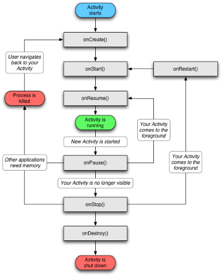

# Chapter 1

Lets start off with the acronyms that you will seen thrown around so you are up to speed with it all. Note some people may find this painfully boring if they are not as new to this world of development.

* I am going to assume you understand what Augmented Reality is and you are here for developing, in that case you might be asking what you need to start.
* First and foremost make sure you are aware of the two things Google did document for us.
    * [A layout guide to the API](https://developers.google.com/tango/apis/c/)
    * [A set of good samples](https://github.com/googlesamples/tango-examples-c/)
        * Note they did a good job showing how to get NDK and Android Studio installed for you and this should be the easiest part of it all... unless you are using Windows, things seem to be an extra step more complicated then.
        
## NDK - what REALLY is is 
* Well the long version is me tell you to watch this great [NDK Video Series](https://www.youtube.com/playlist?list=PL0C9C46CAAB1CFB2B) which is about 90 minutes long.
* If you want the short version just realize that Android is a Unix based OS and runs a Java Virtual Machine ontop of it to allow developers to program in Java over C++. 
    * If you are doing stuff that involves more need of real time data you will have a reason to use the NDK
        * Two common cases are singal processing and graphical related tasker
            * The Tango involves both!
* The other big thing to note is that the whole app isn't in C++ and we are really just writting an extension for it in native code to allow that section to be easier to enhance.

## JNI (Java Native Interface)
* We need to remember that C++ native *machine code* is nothing like the *byte code* and that there needs to be a way to bridge this gap.
* JNI job is to allow you to transfer calls from Java to C++ code and back through some *instresting* syntax that will be covered in further chapters.
* Big take away is when you see **JNI** think "That bridging layer"

## Gradle
* So hopefully doing some C++ development you are familiar with the concept of makefiles, well that is a good way to think of what gradle is for Java and more importantly Android.
* Gradle works off two basic concepts: `projects` and `tasks`
    * more about Gradle later :)
* The main thing for now is to understand that Gradle is what is taking care of building and compiling the code

## adb (Android Debug Bridge)
* adb is the main way to debug your code. It is built into Android Studios and also capable of being used from your terminal as well on the local machine
    * Open a terminal and type `adb device` and see if your device appears
* A popular command you will see is `adb logcat` which is where all your `printf()` are going
    * **Suggestion** is to use it in Anroid Stuido so you can filter it out and avoid the huge amount of noice

## The Android Event Cycle
* A huge thing to understand is that the Tango is just an Anroid application which will follow the Anroid life cycle chart.

* The really big idea to take from this is that there are event driven functions that will be called throughout the applications and are usually where most of the boilerplate code will go to begin with.