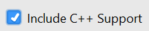
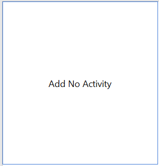

<== [Chapter 2](https://github.com/sjfricke/Tango-C-NDK-Tutorial/blob/master/Chapter_02.md) -- [Chapter 4](https://github.com/sjfricke/Tango-C-NDK-Tutorial/blob/master/Chapter_04.md) ==>

# Chapter 3

--------

## Different Tango devices
* As of now there are only **2** Tango powered devices
    * The Tango Dev Kit 
    * Lenovo Phab 2 Pro 
    * **COMMING SOON** ASUS ZenFone AR 
    
### Dev Kit notes
* The only thing to watch out for is if you have the Dev Kit is that the device being a few years older suffers from a few drawbacks
    * The Tegra chip is **way** less powerful then the Snapdragon 652 the Phab 2 Pro is running
      * The Snapdragon 652 was built on the Adreno 510 GPU
      * The ASUS ZenFone AR is coming with a Snapdragon 821 with the Adreno 530 GPU
    * For production uses, the Phab 2 Pro should be your "Worst Case Phone" for a user to have
    * For development the Dev Kit has a few work arounds to make it work like the Phab 2 Pro due to being capped at Android KitKat
1. You will need to make sure you are running API 19 (if using Dev Kit)
    * The Dev Kit is capped at Android 4.4 KitKat and need to make sure to support that SDK during development
        * The Phab 2 Pro is running Android 6.0 with plans for a 7.0 upgrade in mid to late 2017
        * If you are skipping the dev kit then you will not need API 19
2. The Dev Kit has OpenGL ES 3.1 supported, but being API 19 there is a need for a small hack to get OpenGL ES 3.0+ to run
    * [Stack Overflow post](http://stackoverflow.com/questions/31003863/gles-3-0-including-gl2ext-h)
    * Trust me, you want to have OpenGL ES 3.0+

<== [Chapter 2](https://github.com/sjfricke/Tango-C-NDK-Tutorial/blob/master/Chapter_02.md) -- [Chapter 4](https://github.com/sjfricke/Tango-C-NDK-Tutorial/blob/master/Chapter_04.md) ==>
