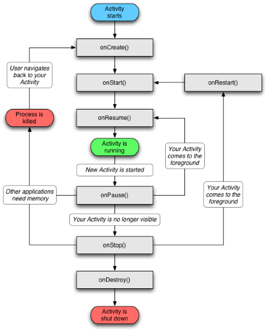

[Chapter 2](./Chapter_02.md) ==>

# Chapter 1 - Android 101

Before we can get all into Android NDK, we need to cover some basic generic Android topics first

* **NOTE:** at any time you get caught up in the lingo of these tutorials there is a [**Glossary available**](/Glossary.md) to help you out.

## Android SDK
* Regardless of using NDK or not, you will still need the Android SDK.
* Android has [various versions](https://en.wikipedia.org/wiki/Android_version_history) which are labed by an **API** value
* Android API 24 == Android SDK 24
    * Each API has it own seperate Android SDK for it
    * Android Studio does a good job letting you download all the ones you will need
* Always check what API or Version your device is running as you get everything setup

## Sandboxing the app
* All Android apps run in a "sandbox" enviroment
* This really just means that your app will not be capable of messing with the other part of the Android OS while it is running.

## The Android Event Cycle
* A huge thing to understand is that your Tango app is like any Android application which will follow the Android life cycle chart.

* The really big idea to take from this is that there are event driven functions that will be called throughout the applications and are usually where most of the boilerplate code will go to begin with.

## Gradle
* So hopefully doing some C++ development you are familiar with the concept of makefiles, well that is a good way to think of what gradle is for Java and more importantly Android.
* Gradle works off two basic concepts: `projects` and `tasks`
* `build.gradle` is the file with all the commands to run
* `gradlew` is just a [gradle wrapper](https://docs.gradle.org/current/userguide/gradle_wrapper.html)
* The main thing for now is to understand that Gradle is what is taking care of building and compiling the code for most the app.

## AndroidManifest.xml
* Every Android app has a `AndroidManifest.xml` file in its root directory
* This is where all configuration happen such as:
    * Changing name of app
    * Giving permission to different parts of the device
    * etc
* [More info](https://developer.android.com/guide/topics/manifest/manifest-intro.html)

[Chapter 2](./Chapter_02.md) ==>