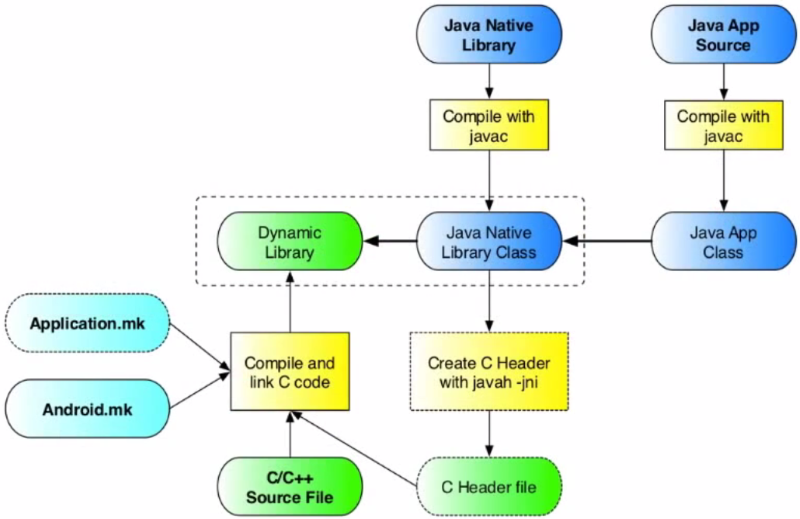

<== [Chapter 1](./Chapter_01.md) -- [Chapter 2.1](./Chapter_02_01.md) ==>

# Chapter 2 - What is NDK

You first must understand the trade-offs you are giving when using NDK before you start heading head first into it.

## NDK
* Stands for Native Development Kit
    * As compared to SDK which is Software Development 
* The first thing is to understand **why** you would use the Android NDK
    * If you are doing stuff that involves more need of real time data processing you will have a reason to use the NDK
        * Two common cases are signal processing and graphical related tasks
            * The Tango involves both!
        * Unity has a huge overhead and AR graphics need to be in real time to look half-way decent
* Abstraction is beatiful and very important part of development, but there times where you need to "do things yourself"
* Before starting your project, read on and decide personally if NDK is right for you!

## Native C/C++
* The **Native** part in NDK just refers to the fact that Android is a Unix OS with a Linux based kernal.
    * The core of all Linux OS's is written in C and this means you can build an entire Android app in C if you please.
* Java doesn't compile to machine code and runs off a Java Virtual Machine (JVM).
* NDK lets you create code that your Android will run on that is compiled to machine code and running "natively" on the device.

## UI Thread
* While you **can** build an NDK app in just C or C++, most apps, including the one in this tutorial, use Java and Android SDK for all the UI.
* During runtime your app will open a thread that runs a JVM.
* Using Java Native Interface (JNI) we will send all UI events down to where all our native C/C++ code is written.

## Breaking down NDK
* We are going to break down the NDK build using this chart (photo cred: Aleksandar Gargenta) by section

    
<== [Chapter 1](./Chapter_01.md) -- [Chapter 2.1](./Chapter_02_01.md) ==>
