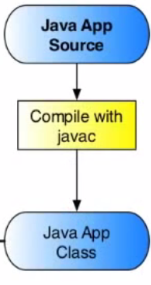

<== [Chapter 2.1](./Chapter_02_01.md) -- [Chapter 2.3](./Chapter_02_03.md) ==>

# Chapter 2.2 - The Java Source

As mentioned before we need to have a **main** Java activity that will act as the main function to start off our app. This is going to be our `DemoActivity.java` file. This will include the call to the activity with

`public class DemoActivity extends Activity { ...`

Here our main activity is started. We will need to name this package as well 

`package com.projecttango.NDK.demo.packageSample;`

We will also for the purpose of working with the Tango want to include a file to help initalize everything for us by go `import com.projecttango.examples.cpp.util.TangoInitializationHelper;`

This file can be found in the [sampleCode](../Sample_Code/java/TangoInitializationHelper.java)

## Inside the Activity
* The two things to worry about your Main Activity is its where you handle all your events like `onCreate`, `onDestory`,etc.
    * If you had GUI like buttons you will need to catch those 
* You also need to create an instance of your renderer which I would advice making a new class and file for

## The Renderer
* **NOTE:** This will go in depth about the graphic rendering in the next two chapters
* The renderer is in charge of calling the `onDrawFrame` call to OpenGL ES each frame.
* It also captures the event on `onGlSurfaceChanged` which is mainly if you rotate the screen orientation and have to resize the window.
* If you plan to bring in assets you will need to use the Android `AssetManager`.
    * This is because the NDK compresses all the files together and you will not be able to get a file pointer otherwise.

### package-info.java
* You may find there is a `package-info.java` file. This file is purly for documentation and is used when generating Javadocs.

<== [Chapter 2.1](./Chapter_02_01.md) -- [Chapter 2.3](./Chapter_02_03.md) ==>
