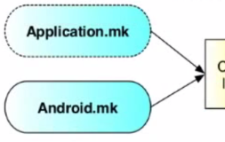

<== [Chapter 2.5](./Chapter_02_05.md) -- [Chapter 2.7](./Chapter_02_07.md) ==>

# Chapter 2.6 - The Makefiles

Now that we have our code, we need to make sure that everything gets built correctly so we can package the APK to the device. These two files will be used when `ndk-build` is ran

# Android.mk
* This file is used to tell which libraries, flags, directories, etc. to use
* [Chapter 7 - Adding a Library](./Chapter_07.md) goes into **great** details about this file
* The main part to take away from it now is that file is what controls the compiling of your native code.

# Applicaiton.mk
* This file is where all the more hardware specific options are set
* `APP_ABI := armeabi-v7a arm64-v8a x86`
	* List all the different ISA to build for. You will see a build for each on listed
		* armeabi-v7a is used by the dev kit
		* arm64-v8a is used by the Lenovo Phab 2 Pro
		* The Android OS will only install the correct version of the compiled build so unless needed, its suggested to keep all main types listed
* `APP_STL := gnustl_static`
	* The *system* runtime is the default if there is no APP_STL definition. You can only select a single C++ runtime that all your code will depend on. It is not possible to mix shared libraries compiled against different C++ runtimes.
	* **NOTE:**: Defining APP_STL in Android.mk has no effect!
* `APP_PLATFORM := android-19`
	* Tells the ndk-build the mininumum version of Android SDK API to build for

<== [Chapter 2.5](./Chapter_02_05.md) -- [Chapter 2.7](./Chapter_02_07.md) ==>
