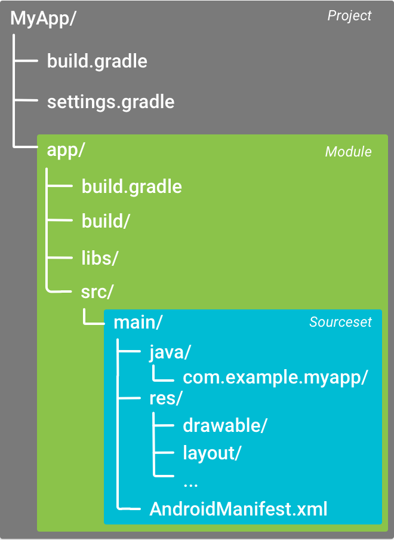

<== [Chapter 2](./Chapter_02.md) -- [Chapter 4](./Chapter_04.md) ==>

# Chapter 3 - Directory Layout

The file structure of NDK can be a little overwhelming at first, but everywhere has a spot and reason for that spot. Here is what the top directory of your project should look like

```
TOP
├───local.properties
│   
├───settings.gradle
│   
├───gradle/
│   
├───build/
│   
└──app
    ├───.externalNativeBuild
    ├───build
    └───src
```

## local.properties
* This file is generated by android studio and shows the path to your SDK and NDK packages for gradle to use when it builds the project with gradle.

## settings.gradle
* This is used to include any other projects, modules, etc to the exisiting project.

## gradle/
* This is where more of the gradle wrapper and other gradle related parts live.

## build/
* This is where all final build will be exported too.
* `app/build` and `app/.externalNativeBuild` also include build results 

## app/src/
* This directory is the main source of program

```
src
└───main
	├───assets
	│   ├─── <image files>
	│   └─── <3D models>
	├───java
	│   └───com
	│       └───projecttango
	│           └───package
	│               └───name
	│                   ├─── <files.java>
	│                   └─── <files.java>
	├───jni
	│   ├─── <files.cpp>
	│   └─── <files.cpp>
	├───res
	│   ├─── <XAML files>
	│   ├─── <XAML files>
	│   └─── <XAML files>
	│
	└─── AndroidManifest.xml
```

## app/src/main
* This is the real heart of your applications, lets break it down

### .../assets
* This is where all assest for your project will go
    * This includes, but not limited to images, textures, audio, video, 3D models

### .../java/com/...
* This is your java files will go
    * Java source files used to handle Android event calls
    * Java native files to talk to the NDK and C++ files
* Java makes a folder for each part of the package name

### .../jni
* This is your C++ and header files
    * This is fully up to you, but this directory acts a local root
    
### .../res
* This are the design files for the layout of the app
    * This folder is in every Android app
    * Android uses XAML for displaying objects

### .../AndroidManifest.xml
* This is the *summary* of your whole project where you declare everything needed
    * If you need to make any setting changes, this is where you will do it
    


<== [Chapter 2](./Chapter_02.md) -- [Chapter 4](./Chapter_04.md) ==>
