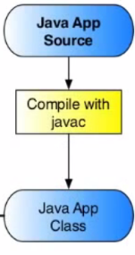

<== [Chapter 3](./Chapter_03.md) -- [Chapter 5](./Chapter_05.md) ==>

# Chapter 4 - The Java Source



## The Activity Class
As mentioned before we need to have a **main** Java activity that will act as the main function to start off our app. This is going to be our hypothetical `DemoActivity.java` file. This will include the call to the activity with
```
import android.app.Activity;
public class DemoActivity extends Activity { ... }
```

Here our main activity is started. We will need to give a name to this package as well like `package com.projecttango.my.NDK.project.packageSample;`.

## Inside the Activity
* The two things to worry about your Main Activity is its where you handle all your events like `onCreate`, `onDestory`, etc.
* The best way to set up this class is to create the three basic event handlers.
```
import android.os.Bundle;

@Override
protected void onCreate(Bundle savedInstanceState) { ... }

@Override
protected void onResume() { ... }

@Override
protected void onPause() { ... }

```

Do this will let you manage the what to do when the app starts and is paused and resumed.

## Tango related
* This will go more in detail in the Tango API section, but this is we also plan to bind the Tango Process with a `ServiceConnection`.
	*  We will also be able to bind the renderer if we plan to use OpenGL ES in our application.

### package-info.java
* You may find there is a `package-info.java` file. This file is purely for documentation and is used when generating Javadocs.

<== [Chapter 3](./Chapter_03.md) -- [Chapter 5](./Chapter_05.md) ==>