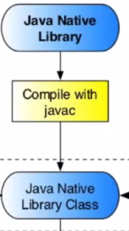

<== [Chapter 4](./Chapter_04.md) -- [Chapter 6](./Chapter_06.md) ==>

# Chapter 5 - The Java Native

Now that we have some code to handle the Java source we need a way to send that source data down to the Native code layer. We will be declaring a series of a native Java function headers that we planned to get called in our Native code layer, also known as JNI (Java Native Interface). The best method is to create another file in your Java directory called `TangoJNINative.java`

## Loading in the native library
* This project depends on tango_client_api, so we need to make sure we load the correct library first.
    * This will be a static call
* We make a system call with `System.loadLibrary("my_native_cpp_module");` to the module we have set up (we do this is later section)

## Declaring a native call
* Java has a native function prefix `native` which we are going to use
* Let's look at an example first
    * `public static native void onGlSurfaceChanged(int width, int height);`
* In this make a native function declaration for the function `onGLSurfaceChanged` which returns void and takes two ints
* ...that's really it, its not to hard once you realize you just need make normal Java based function calls.

## Calling the native functions
* Keeping with our example we will want to call this native function inside our renderer `onGLSurfaceChanged` event call.
* Using `TangoJNINative.onGlSurfaceChanged(width, height);` we now can call the native function from our Java.
    * We are just calling a public function and passing in parameters, this level of abstraction is designed to write Java code without worrying about it getting done on the native side. 

<== [Chapter 4](./Chapter_04.md) -- [Chapter 6](./Chapter_06.md) ==>
