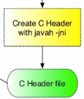

<== [Chapter 5](./Chapter_05.md) -- [Chapter 7](./Chapter_07.md) ==>

# Chapter 6  - The JNI Header



We are now heading over to our `jni` directory. You have ~~two~~ three options for this section:

1. Copy and paste an example and tweak it
2. Have `javah` generate it all for you
3. Write it by hand

## What is the JNI
* As already mentioned, the Java Native Interface is a way to *convert* your Java function calls to C++.
* The JNI file will need to make sure it imports the JNI files with `#include <jni.h>`.
* This file is not a class, but rather a way to be the bridge between the native C and Java code. 
* We will want to make a static instance of our main class from the native code.

## [JNI Data Types](http://docs.oracle.com/javase/8/docs/technotes/guides/jni/spec/types.html)

Because C++ and Java have different data types, we need to use JNI data types to bridge them together
    
|Java primitive type | C type with JNI | Bytes        |
|:------------------:|:---------------:|:------------:|
| boolean            | jboolean        | 1            |
| byte               | jbyte           | 1            |
| char               | jchar           | 2 (unsigned) | 
| short              | jshort          | 2 (signed)   |
| int                | jint            | 4            |
| long               | jlong           | 8            |
| float              | jfloat          | 4            |
| double             | jdouble         | 8            |

| Java Reference Types | C type with JNI |
|:--------------------:|:---------------:|
| java.lang.Class      | jclass          |
| java.lang.String     | jstring         |
| java.lang.Throwable  | jthrowable      |
| java.util.Array      | jarray          |

* **Note:** there is a JNI array type for each of the different primitive types as well.

## Setting up the JVM
* We optionally can to store a reference to the Java Virtual Machine so that we can call into the Java layer to trigger rendering or call back up from the native code to the Java layer.

```
jint JNI_OnLoad(JavaVM* vm, void*) {}
  app.SetJavaVM(vm);
  return JNI_VERSION_1_6;
}

// This part can be anywhere else in your code ...
JavaVM* java_vm_;
void SetJavaVM(JavaVM* java_vm) { java_vm_ = java_vm; }
```
* With this we will now have reference to the JVM held in our C++ class of choice.

## Bridging the function calls
* For this example image we called `public static native void onGlSurfaceChanged(int width, int height);` from the Java thread and will need to create a JNI function call to handle it.
* `JNIEXPORT void JNICALL` will 
    * `JNIEXPORT` contains any compiler directives required to ensure that the given function is exported properly. On Android (and other linux-based systems), that'll be empty.
    * `JNICALL` contains any compiler directives required to ensure that the given function is treated with the proper calling convention. Probably empty on Android as well (it's __stdcall on w32).
    * `void` is the return type and this can be anything such as a `jint`, `jdouble`, etc.
* The JNI expects a certain function name.
    * `Java_com_demo_tutorial_tango_tango_1ndk_1tutorial_TangoJNINative_onGlSurfaceChanged`
    * This a combination of 4 parts
      1. "Java"
      2. Package Name (com.demo.tutorial.tango.tango_ndk_tutorial)
      3. Java Class Name (TangoJNINative)
      4. Function Name (onGLSurfaceChanged)
    * We need to now combine this all into the function name above by concatenating it with underscores
    * **Note:** if the package name contains an underscore we need to represent it as `_1`
* Lastly we now have to pass in the parameters `(JNIEnv* env, jobject clazz, jint width, jint height)`
      * `JNIEvn*` reference to JNI environment, which lets you access all the JNI functions.
      * `jobject` reference to "this" Java object.
        * `jclass` can be used if referencing a class public function
      * `jint width, jint height` these are the arguments passed in from the Java call.
* Now we can pass the values to the C++ function we have created with all the logic
    * `app.OnSurfaceChanged(width, height);`
    * We could do all the logic in here, but best practice to keep the JNI code from your actual business logic separate.

All together we have a bridging function call from the Java source to the native code

```
JNIEXPORT void JNICALL
Java_com_demo_tutorial_tango_tango_1ndk_1tutorial_TangoJNINative_onGlSurfaceChanged(
    JNIEnv*, jobject, jint width, jint height) {
  app.OnSurfaceChanged(width, height);
}
```

That wasn't so bad! It might be a lot of copy and pasting, but after a while you will get the flow of the JNI world.

<== [Chapter 5](./Chapter_05.md) -- [Chapter 7](./Chapter_07.md) ==>
