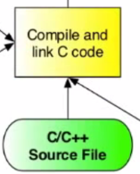

<== [Chapter 6](./Chapter_06.md) -- [Chapter 8](./Chapter_08.md) ==>

# Chapter 7 - The Native Code



So now that we have our function called from the Java source we need to make sure it gets called in our native code.

## Normal C life
* With the JNI taken care of, we can now just write our C/C++ code as if everything was normal.
* In the last chapter we used the demo call of `app.OnSurfaceChanged(width, height);` well this is where we can now implement the code:
```
void DemoApp::OnSurfaceChanged(int width, int height) {
  viewport_width_ = width;
  viewport_height_ = height;
  UpdateViewportAndProjectionMatrix();
}
```

We have now successfully created a native function call when the surface changes from a screen orientation rotation. Now to make sure it all compiles ( Yay, your favorite part ).

<== [Chapter 6](./Chapter_06.md) -- [Chapter 8](./Chapter_08.md) ==>