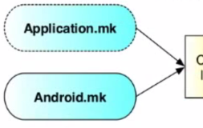

<== [Chapter 7](./Chapter_07.md) -- [Chapter 9](./Chapter_09.md) ==>

# Chapter 8 - The Makefiles

## ndk-build
* So it is possible to use CMake or ndk-build for building your project
* We will be using ndk-build
* CMake is definitely the "newer" choice to use as it is compatible with various other platforms
* Since Tango is a Android platform specific project, I feel justified to use ndk-build
* **Honesty:** I don't know how to build NDK in CMake and anyone who does **please** add it!



Now that we have our code, we need to make sure that everything gets built correctly so we can package the APK to the device. These two files will be used when `ndk-build` is ran

## Applicaiton.mk
* This file is where all the more hardware specific options are set
* `APP_ABI := armeabi-v7a arm64-v8a x86`
	* List all the different ISA to build for. You will see a build for each on listed
		* armeabi-v7a is used by the dev kit
		* arm64-v8a is used by the Lenovo Phab 2 Pro
		* The Android OS will only install the correct version of the compiled build so unless needed, its suggested to keep all main types listed
* `APP_STL := gnustl_static`
	* The *system* runtime is the default if there is no APP_STL definition.
    * You can only select a single C++ runtime that all your code will depend on.
    * It is not possible to mix shared libraries compiled against different C++ runtimes.
	* **NOTE:**: Defining APP_STL in Android.mk has no effect!
* `APP_PLATFORM := android-19`
	* Tells the ndk-build the mininumum version of Android SDK API to build for

## Android.mk
* This file is used to tell which libraries, flags, directories, etc. to use
* The main part to take away from it now is that file is what controls the compiling of your native code
* **Really good** in depth source of details on Anroid.mk files can be [found here](http://android.mk/)
* **ALSO** here is the offical guide sheet [from Google](https://developer.android.com/ndk/guides/android_mk.html)

#### In-depth
* This is where you list all the files you want to compile
* If you add libraries, like tango_gl, need to include its source and headers
* Lets take an example and break it down

```
LOCAL_PATH := $(call my-dir)
PROJECT_ROOT_FROM_JNI := ../../../../..
PROJECT_ROOT := $(LOCAL_PATH)/$(PROJECT_ROOT_FROM_JNI)

include $(CLEAR_VARS)
LOCAL_MODULE := libcpp_plane_fitting_example
LOCAL_SHARED_LIBRARIES := tango_client_api tango_support_api
LOCAL_STATIC_LIBRARIES := png
LOCAL_CFLAGS := -std=c++11
LOCAL_C_INCLUDES := $(PROJECT_ROOT)/tango_gl/include \
                    $(PROJECT_ROOT)/third_party/glm \
                    $(PROJECT_ROOT)/third_party/libpng/include/
					
LOCAL_SRC_FILES := jni_interface.cc \
                   plane_fitting.cc \
                   plane_fitting_application.cc \
                   point_cloud_renderer.cc \
                   $(PROJECT_ROOT_FROM_JNI)/tango_gl/bounding_box.cc \
                   $(PROJECT_ROOT_FROM_JNI)/tango_gl/camera.cc \
                   ...
                   ...
                   $(PROJECT_ROOT_FROM_JNI)/tango_gl/obj_loader.cc

LOCAL_LDLIBS := -lGLESv2 -llog -L$(SYSROOT)/usr/lib -lz -landroid
include $(BUILD_SHARED_LIBRARY)

$(call import-add-path,$(PROJECT_ROOT))
$(call import-add-path,$(PROJECT_ROOT)/third_party)
$(call import-module,libpng)
$(call import-module,tango_client_api)
$(call import-module,tango_support_api)
```

* First not that the `\` is used to continue the line and make the file more readable then having one super long line.
* The `$(call _______)` is a way to call special instructions followed by a paramter if valid
* So first lets start with with `LOCAL_PATH := $(call my-dir)` This sets the variable `LOCAL_PATH` to the directory where the `Android.mk` file is held.
* `PROJECT_ROOT_FROM_JNI := ../../../../..` is just a way to go up to the top directory five folders up and set it to * `PROJECT_ROOT_FROM_JNI` Then we combine the two variables and get the root of the project with `PROJECT_ROOT := $(LOCAL_PATH)/$(PROJECT_ROOT_FROM_JNI)`
* The `include $(CLEAR_VARS)` variable is provided by the build system and points to a special GNU Makefile that will clear many LOCAL_XXX variables for you with the exception of LOCAL_PATH.
* The `LOCAL_MODULE` variable must be defined to identify each module you describe in your `Android.mk`. The name must be *unique* and not contain any spaces.
* `LOCAL_SHARED_LIBRARIES := tango_client_api tango_support_api` - The list of shared libraries *modules* this module depends on at runtime.
* `LOCAL_STATIC_LIBRARIES := png` - The list of static libraries modules (built with `BUILD_STATIC_LIBRARY`) that should be linked to this module. This only makes sense in shared library modules.
* `LOCAL_CFLAGS := -std=c++11` - where we set flags and in this case declare C++ 11
* `LOCAL_C_INCLUDES` - Additional directories to instruct the C/C++ compilers to look for header files in.
* The build system looks at `LOCAL_SRC_FILES` to know what source files to compile, make sure you have them all that you need!
* `LOCAL_LDLIBS` The list of additional linker flags to be used when building your module. **NOTE** you will need -landroid to use the asset_manager library which is part of the `<android/asset_manager.h>` file
* The `BUILD_SHARED_LIBRARY` is a variable provided by the build system that will start building your shared libraries... I know shocker right?
* `$(call import-add-path,$(PROJECT_ROOT))` will go and take your `PROJECT_ROOT` folder and add it to your path list for the next part
* `$(call import-module,<name>)` A function that allows you to find and include the Android.mk of another module by name. A typical example is. This will look for the module tagged `<name>` in the list of directories referenced by your `NDK_MODULE_PATH` environment variable, and include its `Android.mk` automatically for you.  

<== [Chapter 7](./Chapter_07.md) -- [Chapter 9](./Chapter_09.md) ==>