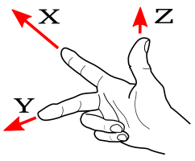

<== [Chapter 2](./Chapter_02.md) -- [Chapter 4](./Chapter_04.md) ==>

# Chapter 3 - Coordinate System

Good way to follow the graphic lesson is talking about the coordinate systems
--------

So there is a good chance you are smarter than me and this doesn't relate to you, but the coordinate system explain in the [Google Tango Guide](https://developers.google.com/tango/overview/coordinate-systems) didn't inherently make sense to me on first read. We are gonna try to clear up confusion to anyone who also was confused.

## Right hand vs Left hand rule
* This is a very basic principle in matrix algebra, but needs to understood quick before moving on. The idea is if I have a coordinate system such that.

```
   ------------> Y              ------------> Y
   |                            |
   |                            |      __ 
   |                            |       /|
   |                            |      /
   |                            |     /  
   V                            V    /
                                        
   X                            X
```

and I move towards `Y` from `X` does `Z` go **INTO** the screen away from you or **out** of the screen towards you.

* If it is **INTO** the screen this is the `Left-Hand rule`.

* If it is **OUT** of the screen this is the `Right-Hand rule`.

Here is a Google image search showing the hand position to why it go its name.



<== [Chapter 2](./Chapter_02.md) -- [Chapter 4](./Chapter_04.md) ==>
