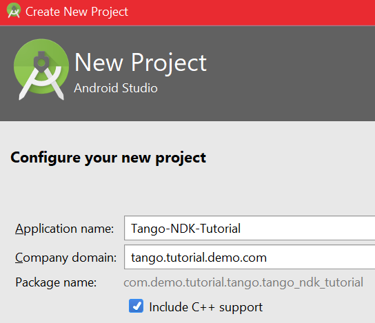
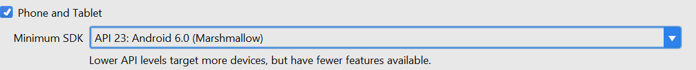
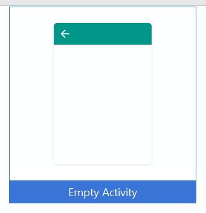
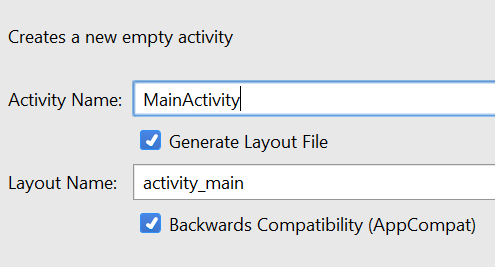
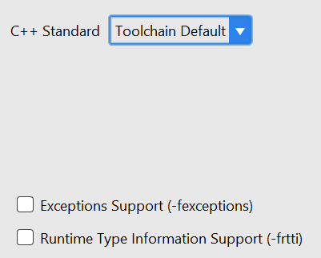

<== [Section 4 - Project](../README.md) -- [Chapter 2](./Chapter_02.md) ==>

# Chapter 1 - Start a new project

We aim to just get a working blank program up and running for this chapter.

* The first thing we need to do is `File > New > New Project`
* 
    * Set the `Application name` and `Company domain` to your desire
    * Make sure to have `Include C++ support`
* 
    * As mentioned we are doing this project with the DevKit not in mind
* 
    * This is optional, but I like the boilerplate it sets up
* 
    * This is a total personal decision
* 
    * I have found no need to not use the default toolchain

* **NOTE:** If it creates an `androidTest` and `test` folder you can ignore this, we are just using the `main` folder for this tutorial. Feel free to write your own test, or better and write a section in this tutorial on how to setup testing!

<== [Section 4 - Project](../README.md) -- [Chapter 2](./Chapter_02.md) ==>