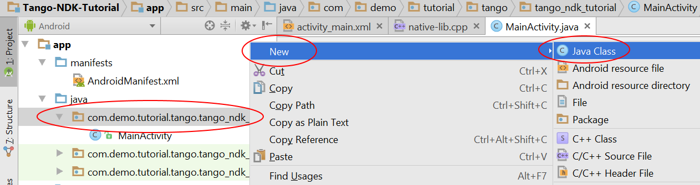

<== [Chapter 2](./Chapter_02.md) -- [Chapter 4](./Chapter_04.md) ==>

# Chapter 3 - Tango Initialization Helper

So one of the big things we need to do is make sure we correctly load the right version of the Tango API Library. Luckily Google has already designed a nice helper class which I see no reason really changing, but also no reason not to modify it if needed. [Tango Initialization Helper Code](../Sample_Code/Tango-NDK-Tutorial/app/src/main/java/com/demo/tutorial/tango/tango_ndk_tutorial/TangoInitializationHelper.java)

* **NOTE:** remember that all new code is going in the `/main/` folder, not the `/test/` or `/androidTest/`
* Go to the Project directory on the side and right click the java folder where your `MainActivity` lives and add a new class called `TangoInitializationHelper`
    * 
* For this file I would just copy and paste [the code sample](../Sample_Code/Tango-NDK-Tutorial/app/src/main/java/com/demo/tutorial/tango/tango_ndk_tutorial/TangoInitializationHelper.java)
    * **NOTE:** make sure to change the name of the package at the top of the file with your package name

## What is this file tl;dr
The idea behind this file is it just looks for the tango by package name and then figures out path to it by type of architecture your phone is.

<== [Chapter 2](./Chapter_02.md) -- [Chapter 4](./Chapter_04.md) ==>
