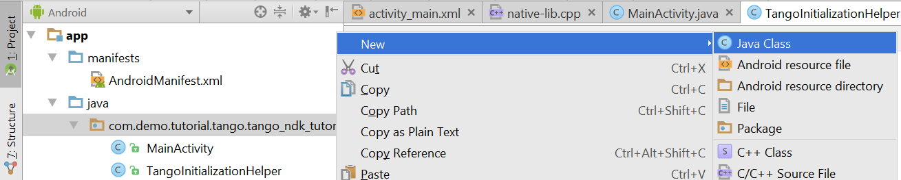

<== [Chapter 3](./Chapter_03.md) -- [Chapter 5](./Chapter_05.md) ==>

# Chapter 4 - JNI Native Class
We need to create a Java class with the JNI to allow our Java functions to get sent down to the Native functions. [Tango JNI Native Class](../Sample_Code/Tango-NDK-Tutorial/app/src/main/java/com/demo/tutorial/tango/tango_ndk_tutorial/TangoJniNative.java)

* Just as we did for`TangoInitializationHelper` we need to create another Java class and we will call it `TangoJniNative` 
    
* The first thing we need to do is call `TangoInitializationHelper.loadTangoSharedLibrary()` and make sure we loaded the library correctly otherwise no point to continue.
* We know need to load the Native C/C++ code into our application by loading it using `System.loadLibrary("tango_ndk_tutorial");`
    * As of now in the tutorial we have not yet wrote this code, but when we do, this is how we call it
    * Take notice that these two loading of native code (Tango Library and our NDK code) takes place right away in the flow of the program
    * **IMPORTANT:** the string `tango_ndk_tutorial` in this case **must** match the `LOCAL_MODULE` library without the `lib` prefix
        * This is more explain in detail in [Chapter 9](./Chapter_09.md)
* Each function we plan to call down to the native layer we need to make a `native` java function declaration
    * Example: `public static native void onCreate(Activity callerActivity);`
        * In this example we will pass the instance of the Activity object to our native code when the Activity calls `onCreate`
* The `public static native int valueFromJNI(int myNumber);` is going to be our example of how we send the value `myNumber` and get a int value returned
* Side note, I removed the `public native String stringFromJNI();` auto generated from the boilerplate

<== [Chapter 3](./Chapter_03.md) -- [Chapter 5](./Chapter_05.md) ==>