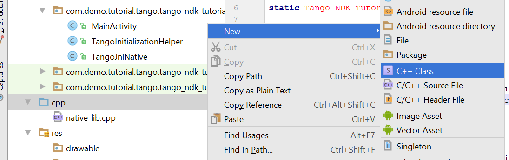

<== [Chapter 6](./Chapter_06.md) -- [Chapter 8](./Chapter_08.md) ==>

# Chapter 7 - Main Native C/C++ code part 1
This is where we will create our main native file. This is part one because we need to configure some settings before moving on.

* First we are going to create the C++ class by adding it in our `cpp` folder
    *  
* So now that we have this class we are going to take a detour and get our build settings set up so we can take advantage of Android Studio's intelesens.

<== [Chapter 6](./Chapter_06.md) -- [Chapter 8](./Chapter_08.md) ==>