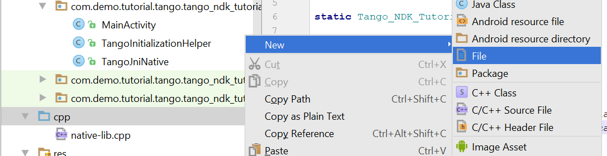
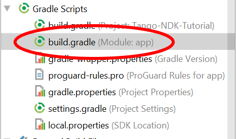
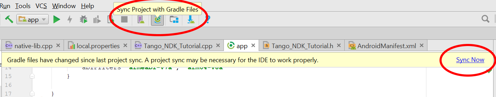

<== [Chapter 8](./Chapter_08.md) -- [Chapter 10](./Chapter_10.md) ==>

# Chapter 9 - NDK-build Files
So this is everyone's favorite part, building our project!

* First thing we need to do is create two *file* type files in our `cpp` folder named `Android.mk` and `Application.mk`
    * 

## Android.mk
* Here is what your `Android.mk` file should look like
```
LOCAL_PATH := $(call my-dir)
PROJECT_ROOT:= $(call my-dir)/../../../..

include $(CLEAR_VARS)
LOCAL_MODULE    := libtango_ndk_tutorial
LOCAL_SHARED_LIBRARIES := tango_client_api tango_support_api
LOCAL_CFLAGS    := -Werror -std=c++11
LOCAL_SRC_FILES := native-lib.cpp \
                   Tango_NDK_Tutorial.cpp
LOCAL_LDLIBS    := -llog -lGLESv3 -L$(SYSROOT)/usr/lib
include $(BUILD_SHARED_LIBRARY)

$(call import-add-path, $(PROJECT_ROOT))
$(call import-module,tango_client_api)
$(call import-module,tango_support_api)
```
* **IMPORTANT:** Since our `LOCAL_MODULE` is `libtango_ndk_tutorial` our `System.loadLibrary("tango_ndk_tutorial");` from [Chapter 4](./Chapter_04.md) must be the same minus the prefix
    * Example:
        * if `LOCAL_MODULE := libtango_tutorial`
        * then `System.loadLibrary("tango_tutorial");`
        
* Also note that if you are not including the Support API you can remove it from the `LOCAL_SHARED_LIBRARIES` section
* If you want to add more C++ files you need to add them to the `LOCAL_SRC_FILES`
* Having `PROJECT_ROOT := $(call my-dir)/../../../..` is probably not the *smoothest* thing and open to better suggestions to get that route!
	* We need the path because it is pointing to our API folder
	* You can change `$(call import-add-path, $(PROJECT_ROOT))` to point to a different location if your API folders are not in the same spot as this tutorial

## Application.mk
* This is super simple
```
APP_ABI := armeabi-v7a arm64-v8a
APP_STL := gnustl_static
APP_PLATFORM := android-23
```
* Note we have option to compile for both ArmV7 and ArmV8 in the `APP_ABI`
	* Almost all mobile phones are built on Arm achitecture and we are just setting which architecture we are going to build for
* We are using gnustl_static and not the c++ std, why, I am not quite sure actually if we need it for Tango
	* You will find that gnustl_static doesn't have a `std::to_string()` method which gets annoying
	* [APP_STL details](https://developer.android.com/ndk/guides/cpp-support.html)
* Also make sure to put the correct API version in this file as well

## Gradle Settings
* The main file we need to edit is the `/app/build.gradle` which is in charge of building our module.
    * 
* First we are going to remove the `externalNativeBuild {}` object from the `defaultConfig` section
* We are going to replace it with
```
ndk {
    abiFilters 'armeabi-v7a', 'arm64-v8a'
}
```
* the `externalNativeBuild {}` object in the `android` section we are going to replace the CMake inside with
```
ndkBuild {
    path 'src/main/cpp/Android.mk'
}
```
* Now we need to Sync our Gradle
    * 
    
## Links to full code in this section
* [Android.mk](../Sample_Code/Tango-NDK-Tutorial/app/src/main/cpp/Android.mk)
* [Application.mk](../Sample_Code/Tango-NDK-Tutorial/app/src/main/cpp/Application.mk)
* [build.gradle](../Sample_Code/Tango-NDK-Tutorial/app/build.gradle)


<== [Chapter 8](./Chapter_08.md) -- [Chapter 10](./Chapter_10.md) ==>