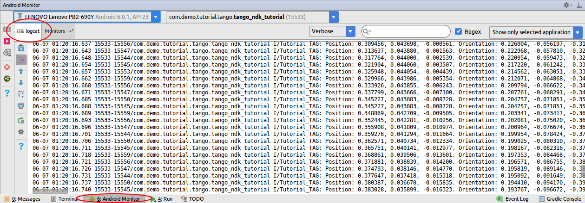

<== [Chapter 10](./Chapter_10.md)

# Chapter 10 - Running the Project

You are now ready to build and run the project. Once you run it you can monitor it all with Logcat using two different methods.

## adb
* Open a terminal
* run `adb logcat`

## Android Montior
Android Studio has a great set of built in debugging tools,

* 
* Note you can filter all the logs in the search bar. This is why we gave a LOG_TAG to make it easier to find certain logs

<== [Chapter 10](./Chapter_10.md)