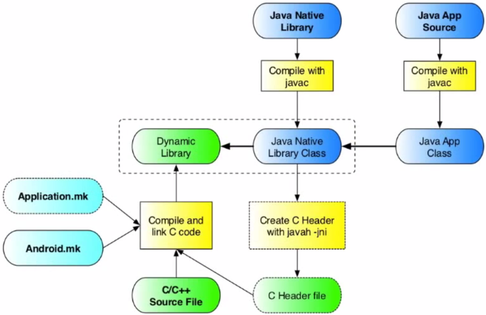

<== [Chapter 1](./Chapter_01.md) -- [Chapter 2.1](./Chapter_02_01.md) ==>

# Chapter 2 - Android NDK

This section is all about the NDK andthe parts of it it related to Tango. You will need to understand the NDK development realm before doing anything with the Tango.

The long version of learning the NDK is telling you to watch theis great [series of videdo on NDK](https://www.youtube.com/playlist?list=PL0C9C46CAAB1CFB2B) which is about 90 minutes long.

## NDK
* The first thing is to understand **why** you would use the Android NDK
    * If you are doing stuff that involves more need of real time data processing you will have a reason to use the NDK
        * Two common cases are signal processing and graphical related tasks
            * The Tango involves both!
        * Unity has a huge overhead and AR graphics need to be in real time to look half-way decent
* The other big thing to note is that the whole app isn't in C++ and we are really just writing an extension for it in native code to allow that section to be easier to enhance.

## Breaking down NDK

We are going to break down the NDK build using this chart (photo cred: Aleksandar Gargenta) by section

## Sections
* [Chapter 2.1 - Directory Layout](./Chapter_02_01.md)
* [Chapter 2.2 - The Java Main Activity](./Chapter_02_02.md)
* [Chapter 2.3](./Chapter_02_03.md)
* [Chapter 2.4](./Chapter_02_04.md)
* [Chapter 2.5](./Chapter_02_05.md)
* [Chapter 2.6](./Chapter_02_06.md)
* [Chapter 2.7](./Chapter_02_07.md)

    
<== [Chapter 1](./Chapter_01.md) -- [Chapter 2.1](./Chapter_02_01.md) ==>
