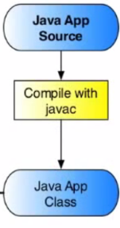

<== [Chapter 2.1](./Chapter_02_01.md) -- [Chapter 2.3](./Chapter_02_03.md) ==>

# Chapter 2.2 - The Java Main Activity

As mentioned before we need to have a **main** Java activity that will act as the main function to start off our app. This is going to be our `DemoActivity.java` file. This will include the call to the activity with

`public class DemoActivity extends Activity { ...`

Here our main activity is started. We will need to name this package as well 

`package com.projecttango.NDK.demo.packageSample;`

We will also for the purpose of working with the Tango want to include a file to help initalize everything for us by go `import com.projecttango.examples.cpp.util.TangoInitializationHelper;`

This file can be fround in the [sampleCode](../sampleCode/TangoInitializationHelper.java)

<== [Chapter 2.1](./Chapter_02_01.md) -- [Chapter 2.3](./Chapter_02_03.md) ==>
