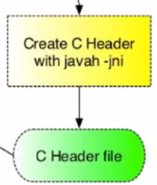

<== [Chapter 2.3](./Chapter_02_03.md) -- [Chapter 2.5](./Chapter_02_05.md) ==>

# Chapter 2.4  - The JNI Header



We are now heading over to our `jni` directory. You have ~~two~~ three options for this section

1. Copy and paste an example and tweak it
2. Have `javah` generate it all for you
3. Write it by hand (just don't)

## What is the JNI
* As already mentioned, the Java Native Interface is a way to *convert* your Java function calls to C++
* The JNI file, for this tutorial we will call `jni_interface.cpp`, will need to make sure it imports teh JNI files with `#include <jni.h>`
* This file is not a class, but rather a way to be the bridge between the native and Java code. 
* We will want to make a static instance of our main class from the native code.
    * For this example we will call it `app`
    * `static tango_demo_module::DemoApp app;`

## [JNI Data Types](http://docs.oracle.com/javase/8/docs/technotes/guides/jni/spec/types.html)

Because C++ and Java have different data types, we need to use JNI data types to bridge them together
    
|Java primitive type | C type with JNI | Bytes        |
|:------------------:|:---------------:|:------------:|
| boolean            | jboolean        | 1            |
| byte               | jbyte           | 1            |
| char               | jchar           | 2 (unsigned) | 
| short              | jshort          | 2 (signed)   |
| int                | jint            | 4            |
| long               | jlong           | 8            |
| float              | jfloat          | 4            |
| double             | jdouble         | 8            |

| Java Reference Types | C type with JNI |
|:--------------------:|:---------------:|
| java.lang.Class      | jclass          |
| java.lang.String     | jstring         |
| java.lang.Throwable  | jthrowable      |
| java.util.Array      | jarray          |

* Note: there is a JNI array type for each of the different primitive types as well

## Setting up the JVM
* We need to store a reference to the Java Virtual Machine so that we can call into the Java layer to trigger rendering

```
jint JNI_OnLoad(JavaVM* vm, void*) {}
  app.SetJavaVM(vm);
  return JNI_VERSION_1_6;
}
```
* With this we will now have reference to the JVM

## Bridging the function calls
* We will have to deal with the syntax this is done in, but we need to export the function calls
* `JNIEXPORT void JNICALL` will 
    * `JNIEXPORT` contains any compiler directives required to ensure that the given function is exported properly. On Android (and other linux-based systems), that'll be empty.
    * `JNICALL` contains any compiler directives required to ensure that the given function is treated with the proper calling convention. Probably empty on Android as well (it's __stdcall on w32).
* We now give a name to the merged call
    * `Java_com_tango_demo_cpp_project_TangoJNINative_onGlSurfaceChanged`
    * We now have to pass in the parameters `(JNIEnv*, jobject, jint width, jint height)`
      * `JNIEvn*` reference to JNI environment, which lets you access all the JNI fucntions.
      * `jobject` reference to "this" Java object.
        * `jclass` can be used if referencing a class public function
      * `jint width, jint height` these are the arguments passed in from the Java call.
* In the function call we can pass the `AssetManager` if needed
    *  `AAssetManager* aasset_manager = AAssetManager_fromJava(env, j_asset_manager);`
* Lastly we need to make the call to the function we will set soon for the native code
    * `app.OnSurfaceChanged(width, height);`

All together we have a bridging function call from the Java source to the native code

```
JNIEXPORT void JNICALL
Java_com_projecttango_examples_cpp_augmentedreality_TangoJNINative_onGlSurfaceChanged(
    JNIEnv*, jobject, jint width, jint height) {
  app.OnSurfaceChanged(width, height);
}

```

<== [Chapter 2.3](./Chapter_02_03.md) -- [Chapter 2.5](./Chapter_02_05.md) ==>
