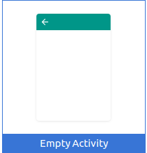
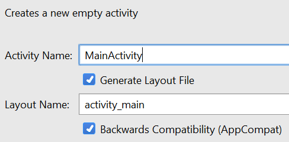

<== [Chapter 3](./Chapter_03.md) -- [Chapter 3.2](./Chapter_03_02.md) ==>

# Chapter 3.1

Start a new project

* Include C++ support

* Minimum SDK should be API 19 if Dev kit, API 23 otherwise
* Empty activity

    * MainActivity 
    
        * check Generate Layout File
* C++11

<== [Chapter 3](./Chapter_03.md) -- [Chapter 3.2](./Chapter_03_02.md) ==>
